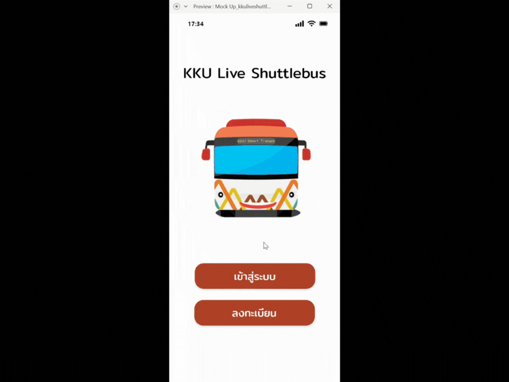

# KKU-Live-Shuttlebus

Project: KKU Live Shuttle Bus App - UI/UX Design & Validation

Link XD: https://xd.adobe.com/view/3a23641f-4ff6-4a72-8218-5f27e924254c-6f70/

As a mini-project for the Human-Computer Interaction (HCI) course, I designed and validated a prototype for a Khon Kaen University (KKU) shuttle bus application. The primary goal was to conceptualize and test a user-friendly interface to improve the campus shuttle experience. This project involved creating mockups using Adobe XD, followed by **usability testing with 8 participants** to gather feedback and identify areas for improvement. The project focused on design and validation, without proceeding to actual development.

**Tools:** Adobe XD

**Key Activities:** UI Mockup Design, Prototyping, Usability Testing (8 participants)

**Objective:** To design an intuitive and efficient mobile application interface for KKU's shuttle bus service, validate its usability, and address potential user needs.

Example:

